# SpikeCV

## Results

1. ### Detect edges
    * Sobel:
        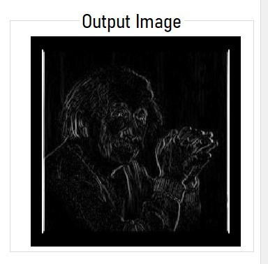
    * Roberts:
        
    * Prewitt and Canny:
        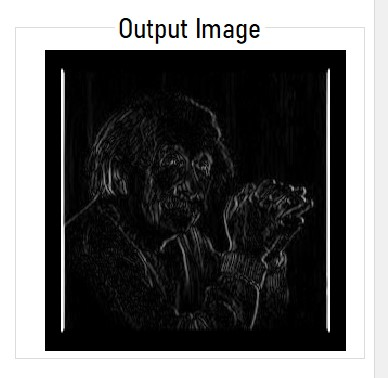

---

2. ### Histogram and Normalization:
        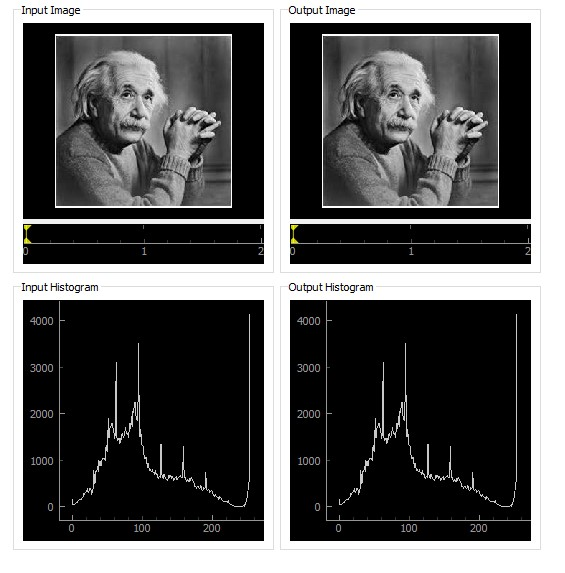
3. ### Local and global thresholding:
        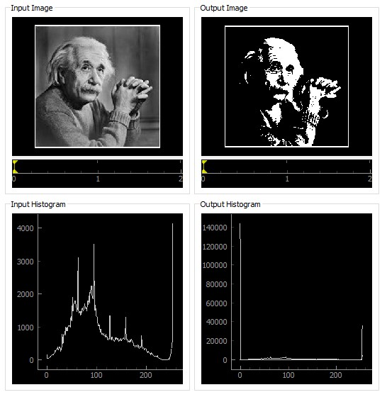

---

4. ### Frequency domain filters
    * Low Pass: 
        
    * High Pass:
        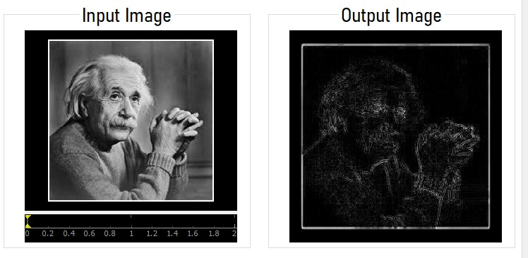
5. ### Hybrid images:
        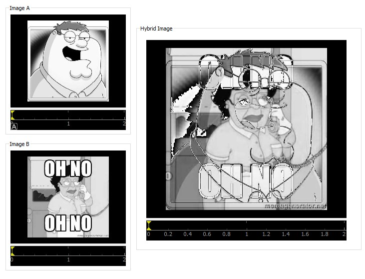

---

6. ### Boundary detection
    * **Canny Superimposed:**
        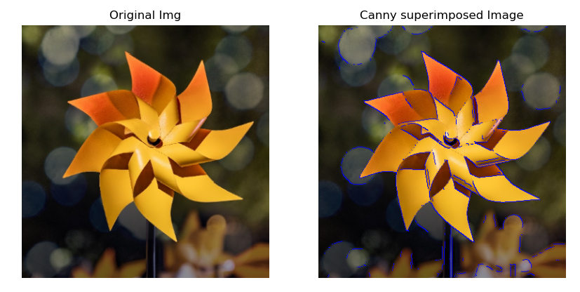
    * **Hough Lines:**
        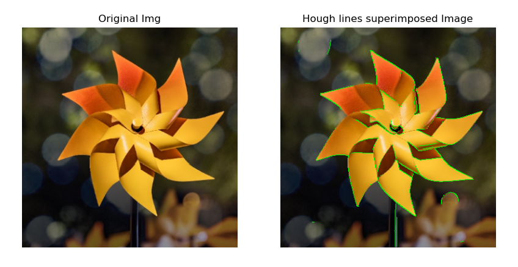
    * **Hough Circles:**
        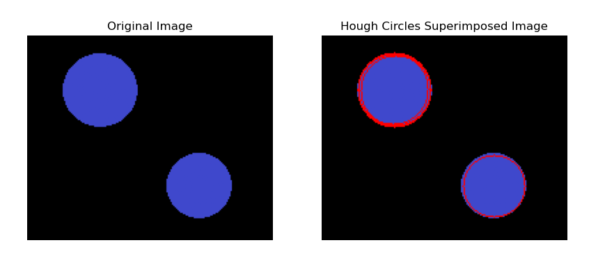

---

7. ### Active Contour
    * **Object:** 
        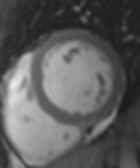
    *  **initialize the contour:** 
        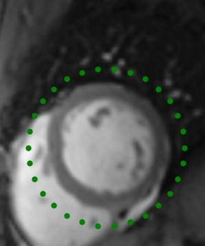
    * **Evolved Contour:**
        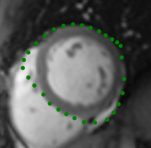

---

8. ### Harris

   - _original image_:

   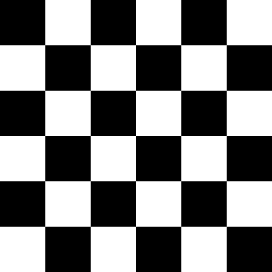

   - _output image_ :

   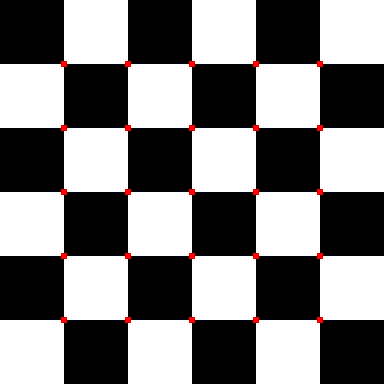

---

9. ### SIFT

   - _original image_:

   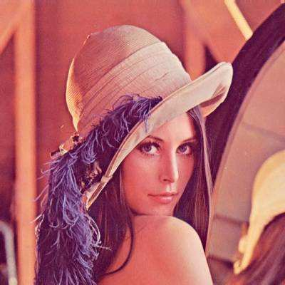

   - _output image_ :

   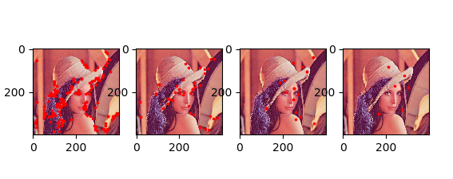

---

10. ### Template Matching

   - _result_:

   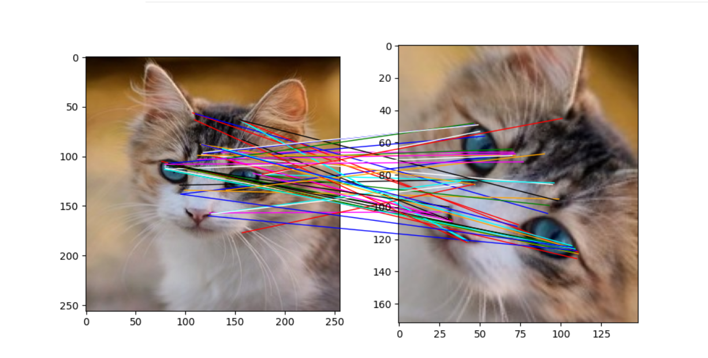

---

11. ### Thresholding
      1. Optimal Otsu's bimodal thresholding
         * Global thresholding: 
            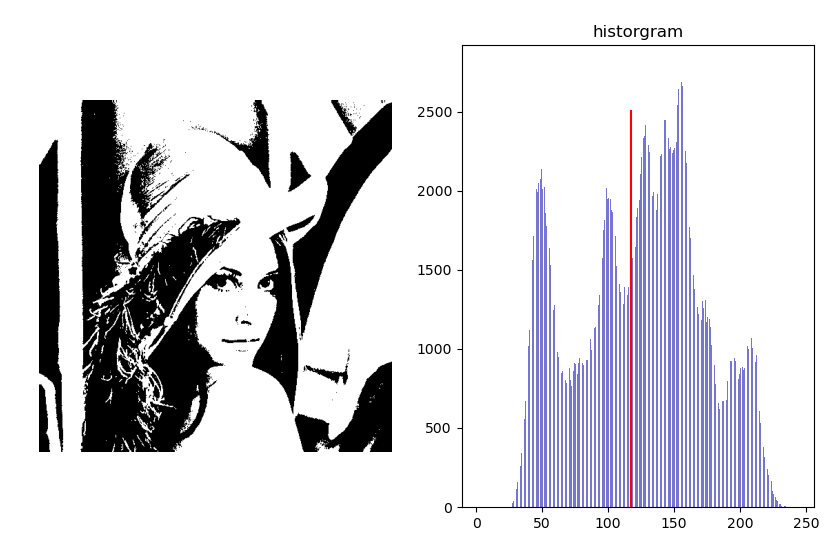
         * Local thresolding: 
            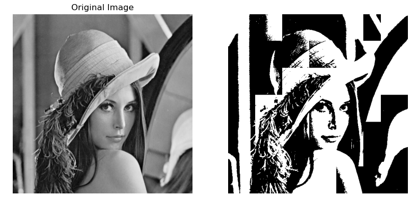
      2. Spectral thresholding (trimodal)
         * Global thresholding: 
            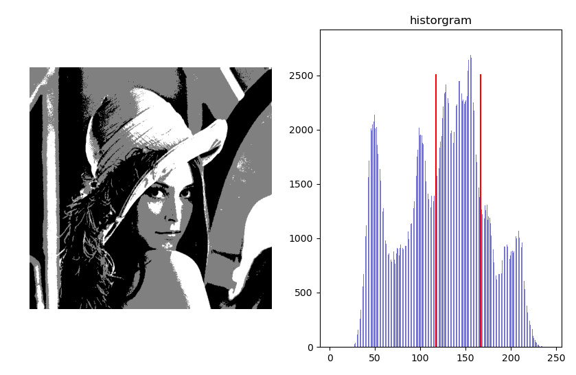
         * Local thresolding: 
            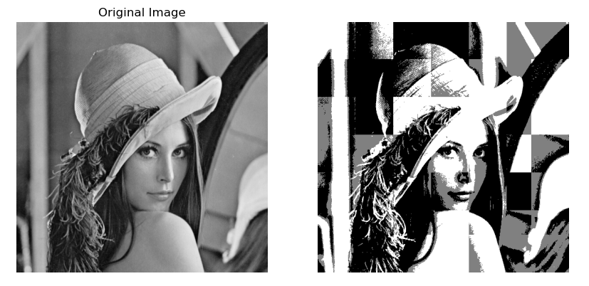
      3. Optimal (iterative) thresholding (trimodal)
         * Global thresholding: 
            
         * Local thresolding: 
            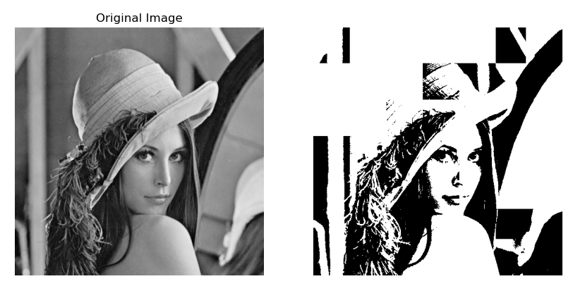
12. ### Segmentation
      1. K-means
         * Input:
         
            
         * Output:
         
            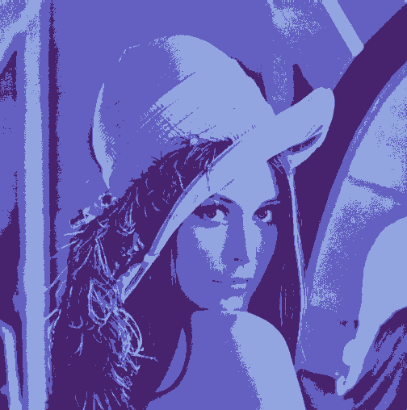
      2. Region Growing
         * Input:
            
            
         * Output:
         
            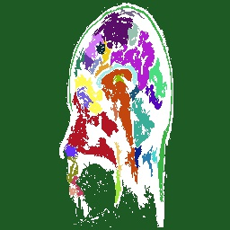
      3. _Agglomerative_ :
         * Input:
         
            
         * Output:
         
            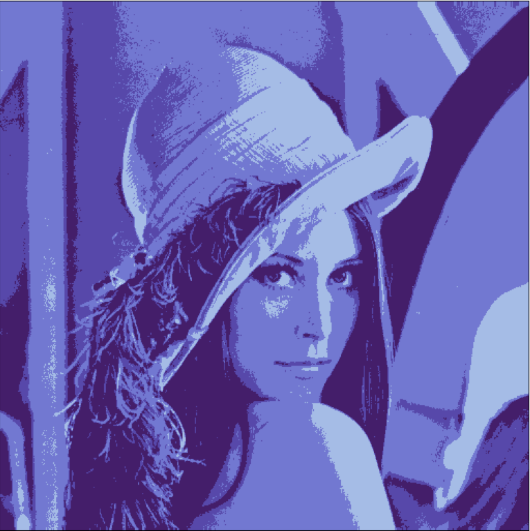
      4. _Mean Shift_ :
         * Input:
         
            
         * Output:
         
            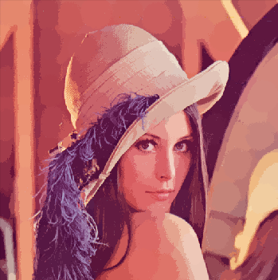

---

13. ### Face Detection
   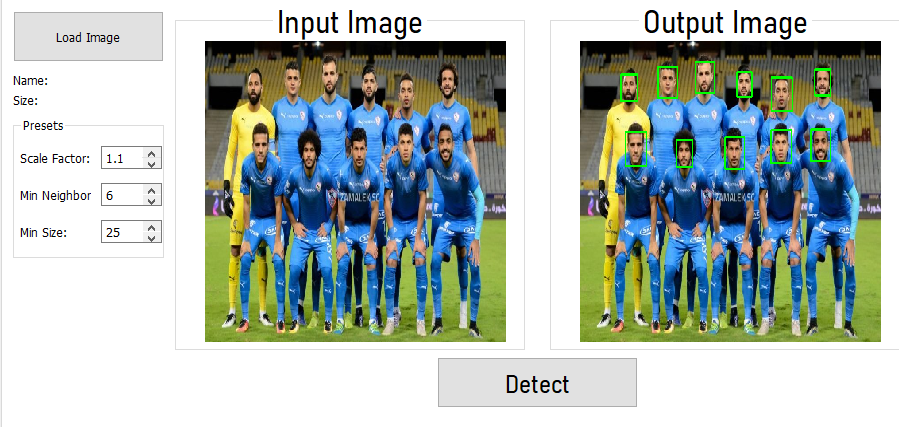
14. ### Face Recognition
   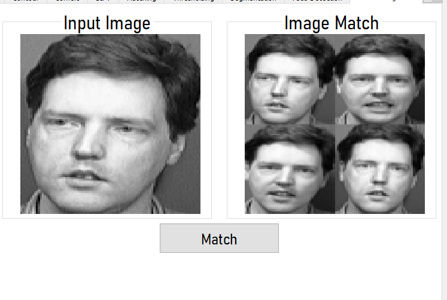
   
