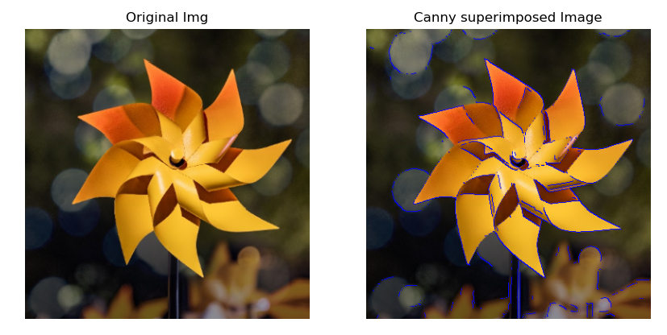
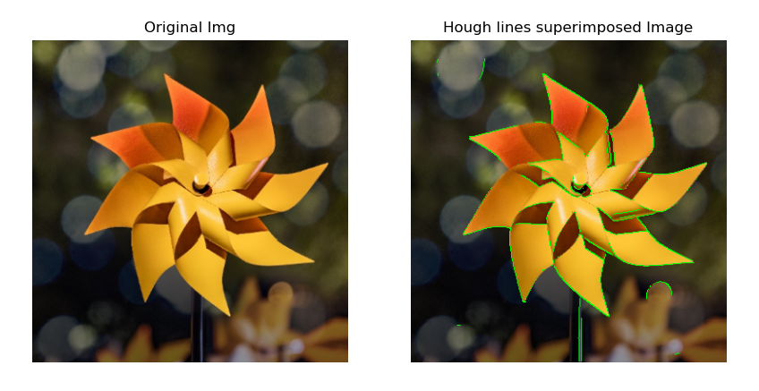
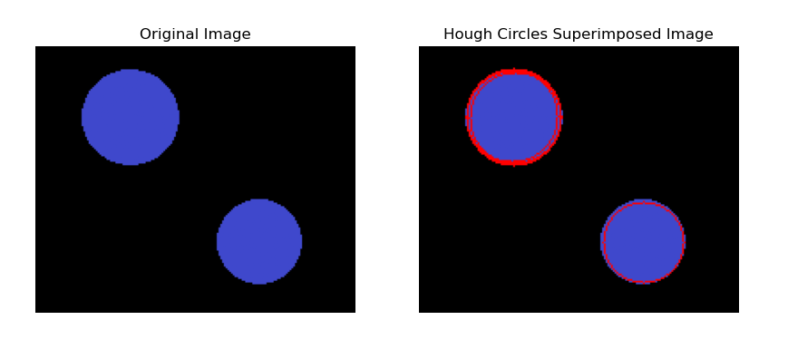
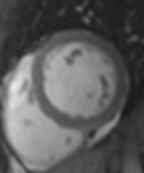
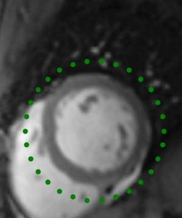
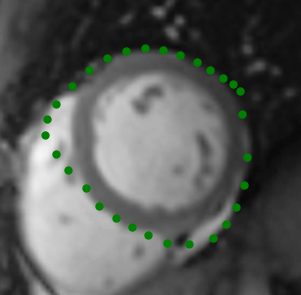

# Assignment 2

## Results

1. ### Boundary detection
    * **Canny Superimposed:**
        
    * **Hough Lines:**
        
    * **Hough Circles:**
        

---

2. ### Active Contour
    * **Object:** 
        
    *  **initialize the contour:** 
        
    * **Evolved Contour:**
        