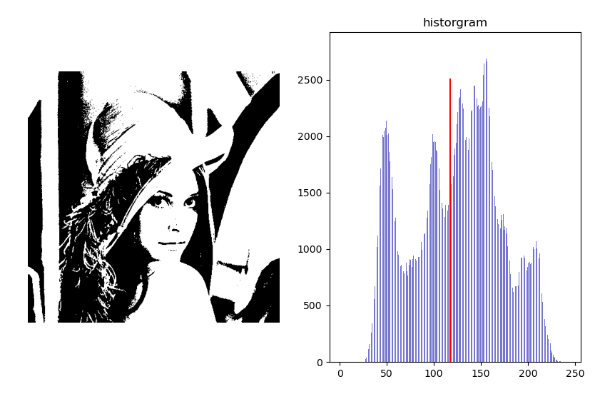
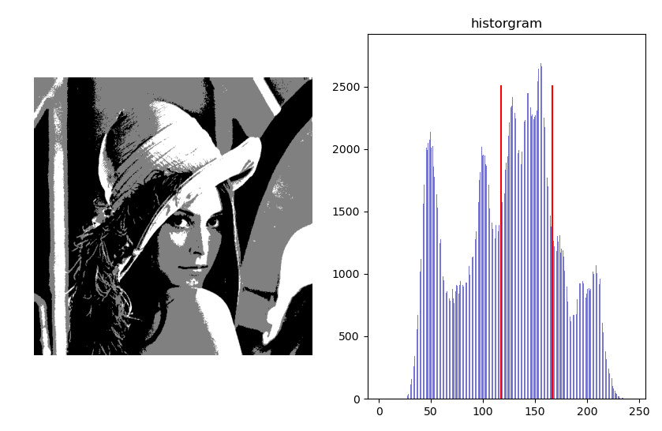

# Task 4 -- Computer Vision

1. Optimal Otsu's bimodal thresholding
    * Global thresholding: 

    * Local thresolding: 

2. Spectral thresholding (trimodal)
    * Global thresholding: 

    * Local thresolding: 
