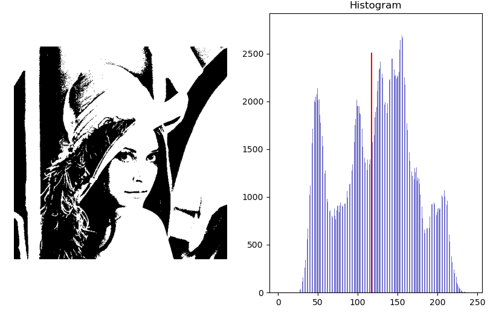
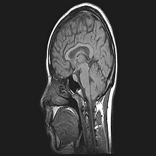
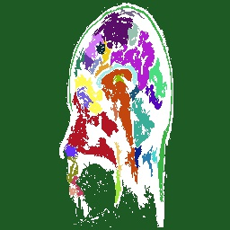
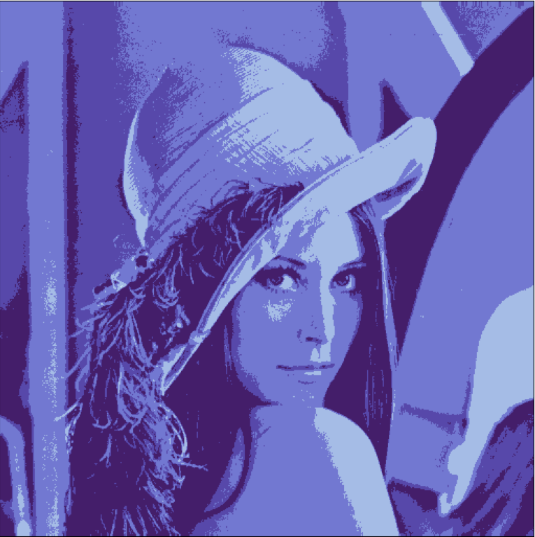

# Task 4 -- Computer Vision

## Results
1. ### Thresholding
   1. Optimal Otsu's bimodal thresholding
       * Global thresholding: 
   
       * Local thresolding: 
   

   2. Spectral thresholding (trimodal)
       * Global thresholding: 
   
       * Local thresolding: 
   
   3. Optimal (iterative) thresholding (trimodal)
       * Global thresholding: 
   
       * Local thresolding: 
   
2. ### Segmentation
   1. K-means
      * Input:
      
      
      * Output:
      
      
   2. Region Growing
      * Input:
       
      
      * Output:
      
      
   3. _Agglomerative_ :
      * Input:
      
      
      * Output:
      
      
   4. _Mean Shift_ :
      * Input:
      
      
      * Output:
      
      
      
   
